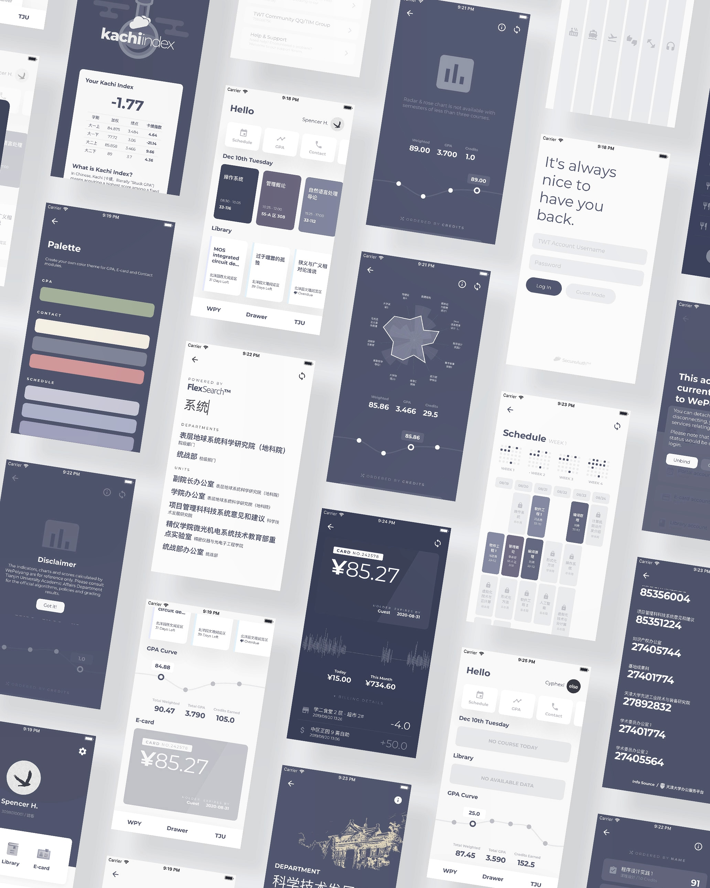

<p align="center">
	
</p>
　

> *There was a gravity - almost a sense of civic responsibility,*
> *to care way beyond any sort of functional imperative.*
>
> — Jony Ives

　

### About 关于

The concept of WePeiyang 4.0 was brought by designer [Owlling](http://www.owlling.com/). Later in July 2019, the development of WePeiyang 4.0 was initiated.

微北洋 4.0 的概念提出自设计师 [Owlling](http://www.owlling.com/)。随后的 2019 年 7 月，开发工作正式启动。

At that time, the previous major version of WePeiyang, functionally mature and time-proven, does not require an immediate update itself. However, our studio did face problems like unbalanced iOS/Android productivity, inconsistency across platforms, and a mediocre UX. The current version therefore primarily focuses on better structure designs, enhanced user experience and bold experiments on new features.

在项目提出之前，上一版本的微北洋已经具有事实上完整的功能模块，也通过了数年的时间检验。它本身无需一次迫切的升级。但是，工作室的技术团队近期确实面临着一些问题，如生产力失衡、不一致的平台体验、欠佳的用户体验等。因此，这一新版本的开发将会侧重于平台一致性、架构设计、大胆的功能探索，并注入更多与体验和视觉相关的思考。




*Runtime Screenshots / 运行时图片*

### Status 状态

Most major modules are developed.

项目各个主要模块已经开发完成。

### New Features to Expect 功能性改进

##### Global Features

| Feature                                                     | 特性                         | Status              |
| ----------------------------------------------------------- | ---------------------------- | ------------------- |
| Custom layout order on homepage                             | 主页自定义模块布局顺序       | ✔                    |
| I18n & multilingual support                                 | 多语言支持                   | ✔                   |
| Data persistent storage & conditional update                | 数据持久性存储与选择性更新   | ✔                   |
| Scroll down to update                                       | 下拉刷新                     | ✔                   |
| Global custom identity font                                 | 全局自定义品牌字体           | ✔                   |
| Latitude of custom theming                                  | 更加完善的主题定制系统       | ✔                   |
| Proper spacing between latin letters & ideograph characters | 中西文混排时自动添加空格间距 | ✔                   |
| Guest login | 体验版账号登入 | ✔                  |
| ......                                                      |                              |                     |


*Theming in GPA Module / 对 GPA 模块对主题自定义*

##### GPA

| Feature                                                     | 特性                         | Status              |
| ----------------------------------------------------------- | ---------------------------- | ------------------- |
| GPA Rose Chart                                              | GPA 玫瑰图                   | ✔                   |
| GPA order by course name                                    | GPA 按照课程名称排序         | ✔                   |
| Toggle your curves                                          | 切换绩点 / 学分 / 加权曲线   | ✔                   |
| Kachi Index                                          | 卡绩指数   | ✔                   |
| *What If*                                          | 增加或删除自定义科目后计算结果   |                    |


##### E-card

| Feature                                                     | 特性                         | Status              |
| ----------------------------------------------------------- | ---------------------------- | ------------------- |
| Spending trend chart in 180 days                     |  180 日消费趋势图      | ✔                   |

##### Library

| Feature                                                     | 特性                         | Status              |
| ----------------------------------------------------------- | ---------------------------- | ------------------- |
| Renew specific books                                     | 指定书籍续借                 | ⚠ (API Malfunction) |

##### Schedule

| Feature                                                     | 特性                         | Status              |
| ----------------------------------------------------------- | ---------------------------- | ------------------- |
| Cancel & delay courses                                      | 取消课程或调课               |                     |
| Responsive course table layout                              | 响应式课表布局               | ✔                   |
| Custom course scheduling & events                           | 自定义课程 / 事件            |                     |
| Support of scheduling conflicts                             | 冲突课程显示                 | ✔                   |


*Responsive course table layout / 响应式课表布局*

##### YellowPage

| Feature                                                     | 特性                         | Status              |
| ----------------------------------------------------------- | ---------------------------- | ------------------- |
| Search algorithm based on FlexSearch.js                           | 基于 FlexSearch 的关键词检索算法                | ✔                   |
| Type-as-you-search                         | 搜索结果即时展现                 | ✔                   |

### Guidelines on UX Design 体验性改进

- Pixel-perfect UI implementation / 像素级精确的设计图还原
- Use transitions & animations / 使用过渡与动画
- Lazy loading on costly charts / 低性能图表的延迟加载
- Settings instantly take effect / 避免设置项变更后重启应用
- Every `Touchable` needs visual feedback / 每一个可触摸元素都需要视觉反馈
- Loading indicators on async actions / 加载时的 Loading 动画指示
- Consistent layout across platforms / 平台无关的一致布局
- ......

### Supported Languages 已支持语言


| Language (Native)                                            | Language | Status              |
| ------------------------------------------------------------ | -------- | ------------------- |
| [English](https://github.com/Cyphexl/WePeiYang-RN/blob/master/app/i18n/en.json) | English  | Supported           |
| [简体中文](https://github.com/Cyphexl/WePeiYang-RN/blob/master/app/i18n/zh.json) | Chinese  | Supported           |
| [عربى](https://github.com/Cyphexl/WePeiYang-RN/blob/master/app/i18n/ar.json) | Arabic   | Partial translation |
| [Espanol](https://github.com/Cyphexl/WePeiYang-RN/blob/master/app/i18n/es.json) | Spanish  | Partial translation |
| [日本語](https://github.com/Cyphexl/WePeiYang-RN/blob/master/app/i18n/ja.json) | Japanese | Partial translation |
| [ไทย](https://github.com/Cyphexl/WePeiYang-RN/blob/master/app/i18n/th.json) | Thai | Partial translation |

More is coming, help is welcome.

更多语言将后续支持，欢迎帮助我们提供翻译。

　

# Start Building 开始构建

### Android

```bash
npm install -g react-native-cli
npm install
react-native link
react-native run-android
```

### iOS (Build on MacOS)

```bash
npm install -g react-native-cli
npm install
react-native link
cd ios && pod install
cd ..
react-native run-ios
```

Note that to run the above commands, you need to ensure several prerequisites in your building environment. Please refer to [React Native: Getting Started](https://facebook.github.io/react-native/docs/getting-started.html) for the most up-to-date building indications. React-Native CLI is used here.

请注意，为了使上述命令顺利运行，你的构建环境需要满足一些前提条件。请参考 [React Native: 开始构建](https://facebook.github.io/react-native/docs/getting-started.html) 以获取最新版本的构建要求和步骤。本项目使用的是 React Native CLI 而非 Expo CLI。

　

# Project Structure 项目架构

WePeiyang-RN is initiated with `react-native-cli` along with a few customized modifications.

微北洋 RN 使用 `react-native-cli` 初始化，并对原始文件结构应用了少许变更。

```
WePeiyang-RN
├── android
├── ios
├── app
│   ├── i18n
│   ├── store.ts
│   ├── actions
│   ├── reducers
│   ├── components
│   ├── navigation
│   ├── screens
│   ├── services
│   ├── theme
│   ├── utils
│   ├── app.tsx
│   ├── environment-variables.ts
├── __test__
├── README.md
├── index.js
└── package.json
```

### I18n

Files related to i18n and multilingual support, such as translation logics and string resources, live here.

此处放置和多语言支持有关的文件，如翻译逻辑、字符串资源等。

### Store.ts, Actions & Reducers

Files related to Redux structure live here. For information about store, actions & reducers in Redux, please refer to Redux official docs.

这些文件夹和文件与 Redux 有关。了解它们的具体用途，请参见 Redux 官方文档或 Flux 设计架构说明。

### Components

This is where the global components live. It includes several HOC over native components as well as normal presentational components. Note that when a component is designed to use in one particular module, put that in the corresponding module folder in `/screens` instead.

此处放置所有的全局组件。它包含了文本、按钮、输入框等原生 React-Native 组件的 HOC，也包括了一些全局的展示型组件。注意，当一个组件在设计上仅可能被某一个模块使用时，应该放置在对应的模块 Screens 的文件夹中。

### Navigation

This is where the navigators live. Navigators define the navigation structure of the app.

此处定义了用于定义应用页面之间导航结构的 Navigators。

### Services

This is where the related services live. Currently it contains `TWTFetch`, the network request service under the TWT Open API request standard.

此文件夹包含了应用内的服务模块。目前，它主要提供基于 TWT Open 接口请求标准的网络请求服务。

### Screens

This is where the screens live. A screen defines a page of the app, and usually contains several components. Screens of the same module should be placed under the same subdirectory. Local components, resources and other module-specific files can be found here, too.

此处定义了应用内的各个屏幕。通常，一个屏幕由许多组件组成。属于同一模块的 Screen 应该归至相同的文件夹中，该文件夹内也可能包含局部的组件、资源和其他文件。

### Theme

Files in this folder define all parameters and methods related to visual identity & styling.

此处定义了所有和应用视觉样式有关的参数，如颜色、字体与 Spacing 等。

### Utils

Files in this folder define some tool functions or variables, or files that could not be categorized into other directories.

此处定义一些工具类变量和函数，或一些很难分到其它类别中的内容。

　

# Elsewhere 别处

- [TWT Studio 主页](https://coder.twtstudio.com/index)
- [TWT 移动应用发布平台](https://mobile.twt.edu.cn/)
- [WePeiyang Android 3.0](https://github.com/twtstudio/WePeiYang-Android)
- [WePeiyang iOS Everest](https://github.com/twtstudio/WePeiYang-iOS-Everest)
- [WePeiyang API](https://github.com/twtstudio/WePeiYang-Api)
- [关于课程表的思考：微北洋 Schedule Screen 的设计与实现](http://www.tzingtao.com/2019/08/29/Thinking-in-TimeTables-WePeiyang-Schedule-Screen-Design-Implementation/)

　

# License 协议

A license would be published after the first release. Before that happens, issues are pull requests are welcomed.

协议会发布在项目第一版开发完成之后。在此之前，欢迎任何问题讨论与合并请求。

　

<p align="center">
	
</p>
